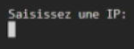

# Crecerelle

## Description
Crecerelle est une toolbox python permettant de préparer les premières étapes d'un pentest sur un domain ou une ip donnée.

## Table des matières
- [Installation](#installation)
- [Fonctionnalités](#fonctionnalités)
- [Utilisation](#utilisation)
- [Configuration](#configuration)
- [Licence](#licence)

## Installation
1. Clonez le dépôt : 
   ```bash
   git clone https://github.com/A2L1/crecerelle.git
    ```

    ```bash
    cd crecerelle/
    ```

## Utilisation

Crecerelle est une toolbox guidée exécuté en docker. L'outil est donc supporté sur tous les OS pouvant exécuté Docker.

### Execution de l'outil

1. Construction de l'image docker

    ```bash
    docker build -t crecerelle .
    ```

2. Execution de l'image docker

    Exécute la toolbox

    ```bash
    docker run -v {path_to_directory}/crecerelle-project/utils/load:/crecerelle-project/utils/load -it crecerelle
    ```

    NB -v : permet de créer un volume partagé entre le container et l'host pour récupérer les données des différentes actions ainsi que le rapport pdf.

## Fonctionnalités

### Projects Management

Crecerelle propose la possibilité de séparer ses tâches par projet, ainsi vous pourrez créer un nouveau projet ou chargé un projet déjà existant afin de continuer avec ce dernier.


#### Choix 1 - Création de projet

<!-- 
 -->
Après avoir choisi de créer un projet, vous devrez donner un nom de projet pas encore utilisé. Ici le projet est "Antoria". Un dossier pour ce project est donc créer.


#### Choix 2 - Chargement d'un project existant

Vous pouvez sélectionner un projet exisant afin de reprendre où vous en étiez.


### Kill chain steps

Vous entrez ensuite dans le coeur de l'outil. Vous pouvez alors choisir différentes étapes de la killchain

 

#### Reconnaissance

Pour l'instant, la seule possibilité est de récupérer les IP lié à un domaine et les sous-domaines en lien avec ce dernier.


Saissez ensuite le nom de domaine à investigué.


#### Enumeration

L'énumération va réaliser un scan nmap vulners sur les ip qui sont renseignés. Deux possibilités :

- Chargement une liste d'ip provenant d'un scan réalisé dans la partié [reconnaissance](#reconnaissance)


#### Choix 1 - Chargement d'une liste d'ip pour un domaine

La liste des scans de reconnaissance disponible dans le projet est alors affichée. Vous devez alors choisir la liste d'ip que vous voulez.


#### Choix 2 - Choix d'ip

Vous pouvez également choisir une IP ou une plage d'IP si vous n'avez pas de liste à charger depuis l'énumération.



#### Weaponization

Dans cette partie de la killchain vous pourrez : 

1. Récupérer la liste des exploits disponibles pour un scan nmap réalisé dans la partie énumuration
2. Choisir un exploit pour un scan,ip,port donné.   Attention ceci néccéssite qu'une liste des exploits existent (voir Weaponization/1.). Une fois choisi, l'exploit est chargé dans un dossier et une session bash est ouverte afin que l'utilisateur puisse configurer l'exploit et s'en servir.


#### Choix 2

Cette fonctionnalité du programme permet de choisir un exploit et de charger une session bash avec l'exploit dans le dossier courant.


